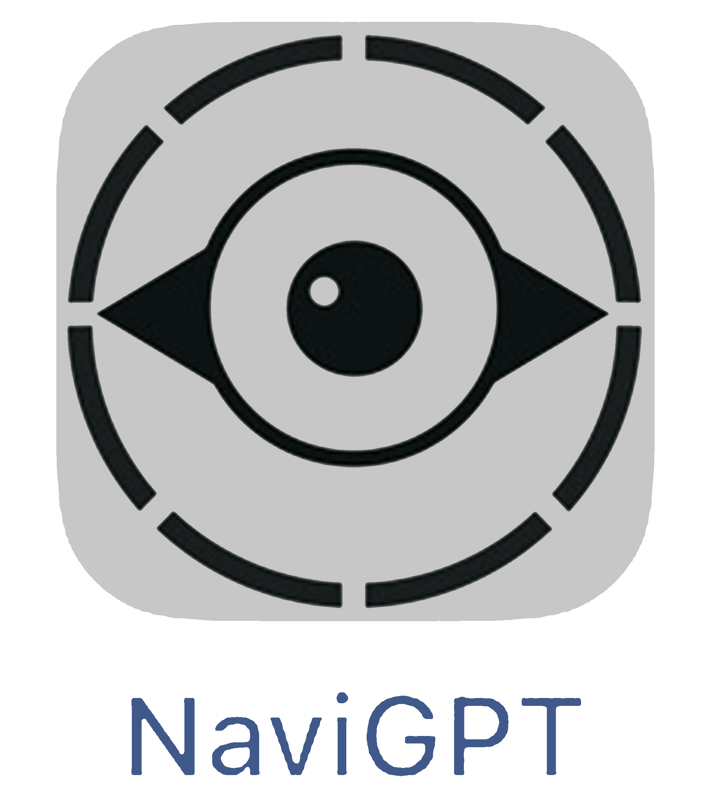

# NaviGPT: A Real-Time AI-Driven Mobile Navigation System

[](https://github.com/PSU-IST-CIL/NaviGPT)


[](https://github.com/PSU-IST-CIL/NaviGPT/blob/main/LICENSE)

NaviGPT is now **fully open-source**. This real-time, AI-powered mobile navigation system is designed to assist people with visual impairments (PVI) by integrating LiDAR obstacle detection, vibration feedback, and large language model (LLM) guidance.

~~If this project helps or inspires you, please  the repository and cite the relevant paper! The open source version will be released on date of Conference (GROUP '25).~~

#### Principal developers and maintainers of the repository: @[PSU-IST-CIL/NaviGPT](https://github.com/orgs/PSU-IST-CIL/teams/navigpt)
----
## Enhancing the Travel Experience for People with Visual Impairments through Multimodal Interaction: NaviGPT, A Real-Time AI-Driven Mobile Navigation System [](https://arxiv.org/abs/2410.04005) [](https://arxiv.org/html/2410.04005v1)
### He Zhang<sup>α</sup>, Nicholas J. Falletta<sup>α</sup>, Jingyi Xie<sup>α</sup>, Rui Yu<sup>β</sup>, Sooyeon Lee<sup>γ</sup>, Syed Masum Billah<sup>α</sup>, John M. Carroll<sup>α</sup>
 <sup>α</sup> College of Information Sciences and Technology, Penn State University, University Park, Pennsylvania, USA
 
 <sup>β</sup> Department of Computer Science and Engineering, University of Louisville, Louisville, KY, USA
 
 <sup>γ</sup> Ying Wu College of Computing, New Jersey Institute of Technology, Newark, NJ, USA
 

<p align="center">Figure 1. Workflow of NaviGPT. The image illustrates the workflow of the NaviGPT system designed to assist people with visual impairments (PVI) in navigating their surroundings through a combination of LiDAR, vibration feedback, and AI-generated guidance. At the top, two mobile screens show the interface where users can input a destination using either text or speech. This activates the navigation system, which displays a walking route on a map. The central part of the image focuses on LiDAR detection, depicted as a yellow detection zone scanning the path in front of the user. The LiDAR detection identifies obstacles, shown as a post in the user’s path, marked with a yellow square on the phone screen. Below, a PVI user holds the phone and receives real-time feedback through vibration. The vibration frequency increases as the distance between the user and the obstacle decreases. This is represented on a spectrum, with blue indicating a far distance (slow vibration) and green indicating proximity (fast vibration). On the right, a pre-designed prompt engineering pipeline connects to an API (GPT-4), which processes the obstacle data and provides descriptive guidance through voiceover. This guidance informs the user of the obstacle and offers navigational suggestions, ensuring safe passage. The image emphasizes how NaviGPT integrates LiDAR, tactile feedback, and AI-generated responses to provide a real-time, user-friendly navigation experience for PVI.</p>

----
## Abstract/Introduction:
Assistive technologies for people with visual impairments (PVI) have made significant advancements, particularly with the integration of artificial intelligence (AI) and real-time sensor technologies. However, current solutions often require PVI to switch between multiple apps and tools for tasks like image recognition, navigation, and obstacle detection, which can hinder a seamless and efficient user experience. In this paper, we present NaviGPT, a high-fidelity prototype that integrates LiDAR-based obstacle detection, vibration feedback, and large language model (LLM) responses to provide a comprehensive and real-time navigation aid for PVI. Unlike existing applications such as Be My AI and Seeing AI, NaviGPT combines image recognition and contextual navigation guidance into a single system, offering continuous feedback on the user's surroundings without the need for app-switching. Meanwhile, NaviGPT compensates for the response delays of LLM by using location and sensor data, aiming to provide practical and efficient navigation support for PVI in dynamic environments.

### Citation
Please cite these papers in your publications if NaviGPT helps your research.
```
@inproceedings{10.1145/3688828.3699636,
author = {Zhang, He and Falletta, Nicholas J. and Xie, Jingyi and Yu, Rui and Lee, Sooyeon and Billah, Syed Masum and Carroll, John M.},
title = {Enhancing the Travel Experience for People with Visual Impairments through Multimodal Interaction: NaviGPT, A Real-Time AI-Driven Mobile Navigation System},
year = {2025},
isbn = {9798400711879},
publisher = {Association for Computing Machinery},
address = {New York, NY, USA},
url = {https://doi.org/10.1145/3688828.3699636},
doi = {10.1145/3688828.3699636},
pages = {29–35},
numpages = {7},
keywords = {AI-assisted tool, People with visual impairments, accessibility, disability, llm, mobile application, multimodal interaction, navigation, prototype},
location = {Hilton Head, New Jersey, USA},
series = {GROUP '25}
}
```

---
## 🚀 How to Build and Run Locally

1. Download the folder `NaviGPT_build_from_here` to your local machine.
2. Open the folder using **Xcode**.
3. Connect your **iPhone device** (iPhone 12 Pro or later).
4. Press **Build** to deploy the app onto your iPhone.
---
## 🔑 API Configuration (Required)
We have removed the default API key for security reasons.

To enable full functionality:
1. Navigate to:
NaviGPT_build_from_here → NaviGPT → llmManager.swift
2. Locate **line 7**, which contains the placeholder:
```let apiKey = "Input-Open-AI-API-Here"```
Replace it with your own OpenAI API key.

## 📱 Notes on Deployment

Once you complete the above steps and successfully deploy the app to your iPhone,  
you may **disconnect your device from your Mac** — the app will continue to run as expected.
Please note that since this is a **developer build**, iOS requires re-signing and rebuilding the app **after a limited period**.
You are free to use and modify this open-source version under the terms of the license.

## 📄 License

This project is licensed under the **Creative Commons Attribution-NonCommercial 4.0 International (CC BY-NC 4.0)** license.

You are free to:

- Share — copy and redistribute the material in any medium or format  
- Adapt — remix, transform, and build upon the material

**Under the following terms:**

- **Attribution** — You must give appropriate credit and indicate any changes.  
- **NonCommercial** — **Commercial use is strictly prohibited** without prior written permission.

For full license details, please see the [LICENSE](./LICENSE) file or visit the [CC BY-NC 4.0 website](https://creativecommons.org/licenses/by-nc/4.0/).

